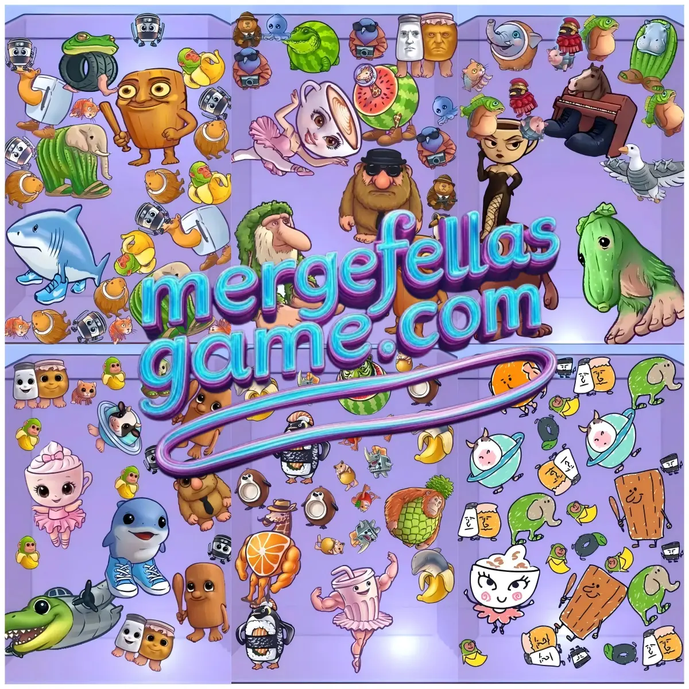

# Merge Fellas Italian Brainrot

## The Ultimate Italian Brainrot Merging Experience

Merge Fellas brings the viral TikTok meme sensation to your browser! Combine iconic characters like Tung Tung Tung Sahur, Brr Brr Patapim and Espressona Signora into ever-evolving forms in this addictive merge puzzle game.

## ✨ Features

- **Seven Distinct Editions** featuring 50+ unique brainrot meme characters
- **Real-time Global Leaderboards** - compete with players worldwide
- **Zero Advertisements** - pure gameplay without interruptions
- **Special Assistance Features**:
  - **Shake Button** - randomly merges characters when stuck
  - **OH-NO Button** - rescues your endgame board without restarting
- **Mobile & Desktop Compatible** - play anywhere, anytime
- **No Downloads Required** - instant browser gameplay at mergefellasgame.com

## 📋 Update Log & Available Editions

- **2025-05-09**: Initial release of **[Merge Fellas Italian Brainrot](https://mergefellasgame.com/)** 🏆
  - The original sensation featuring iconic characters like Tung Tung Tung Sahur and Tralalero Tralala
  - Master the basics of brainrot merging in this first edition that started it all
  - Global leaderboard system integrated from launch

- **2025-05-12**: Launch of **[Merge Fellas Italian Brainrot Lite](https://mergefellasgame.com/merge-fellas-italian-brainrot-lite)**
  - Streamlined experience with 11 iconic meme characters
  - Perfect for quick gameplay sessions with refined mechanics
  - Smooth chain reactions and optimized performance

- **2025-05-15**: Released **[Merge Fellas Italian Brainrot II](https://mergefellasgame.com/merge-fellas-italian-brainrot-2)** 🏆
  - The chaotic sequel introduces fresh characters including Ballerina Cappuccina and Brr Brr Patapim
  - Enhanced board mechanics with more challenging combinations
  - Global leaderboard competition activated

- **2025-05-17**: **[Merge Fellas Italian Brainrot III](https://mergefellasgame.com/merge-fellas-italian-brainrot-3)** launched 🏆
  - The explosive chapter brings 11 bizarre characters including Svinino Bombondino and Espressona Signora
  - Advanced merge combinations and animations
  - Competitive ranking system implemented

- **2025-05-23**: **[Merge Fellas Italian Brainrot Baby](https://mergefellasgame.com/merge-fellas-italian-brainrot-baby)** released 🏆
  - Discover adorable baby versions of your favorite meme characters
  - Kawaii aesthetic twist on the viral Italian Brainrot series
  - Global leaderboard functionality included

- **2025-05-31**: **[Merge Fellas Italian Brainrot IV](https://mergefellasgame.com/merge-fellas-italian-brainrot-4)** unveiled 🏆
  - The wildest meme chaos yet with fresh bizarre characters and outrageous designs
  - Push your merging skills to new limits
  - Competitive leaderboard system active

- **2025-06-05**: **[Merge Fellas Italian Brainrot Artistic](https://mergefellasgame.com/merge-fellas-italian-brainrot-artistic)** launched 🏆
  - Unique doodle-style artistic edition with hand-drawn characters
  - Features Bombardiro Crocodilo and Tung Tung Tung Sahur in bad drawing aesthetic
  - Global ranking competition available

## 🏆 Global Ranking System

Enter your name before playing to join our global ranking system! Your scores will be recorded and displayed on the real-time leaderboard, allowing you to compete with players worldwide. Most editions feature competitive leaderboards where you can track your progress and challenge other players.

## 🎯 How to Play

1. Drag and drop similar brainrot characters to merge them into evolved forms
2. Keep the center clear for maximum flexibility
3. Group similar characters for quick chain merges
4. Use board edges to store characters you're not ready to merge
5. Watch the upcoming character indicator in the top-right corner
6. When stuck, use the shake or OH-NO features to continue your merging spree

## 🔜 Coming Soon

Stay tuned for more editions, characters, and special events!

## 🌐 Play Now

Visit [mergefellasgame.com](https://mergefellasgame.com) to start merging or choose your favorite edition:

- **[Original Edition](https://mergefellasgame.com/)** - The classic that started it all
- **[Baby Edition](https://mergefellasgame.com/merge-fellas-italian-brainrot-baby)** - Kawaii meme characters  
- **[Artistic Edition](https://mergefellasgame.com/merge-fellas-italian-brainrot-artistic)** - Unique doodle aesthetic
- **[Lite Edition](https://mergefellasgame.com/merge-fellas-italian-brainrot-lite)** - Quick streamlined gameplay
- **[Latest Editions](https://mergefellasgame.com/italian-brainrot)** - Discover all versions

### Related Games
- **[2048 Italian Brainrot](https://mergefellasgame.com/2048-italian-brainrot)** - Classic 2048 with meme characters
- **[Italian Brainrot Clicker 2](https://mergefellasgame.com/italian-brainrot-clicker-2)** - Tap into chaos
- **[Italian Brainrot Battle](https://mergefellasgame.com/italian-brainrot-battle)** - Character showdown
- **[Italian Brainrot Quiz](https://mergefellasgame.com/italian-brainrot-quiz)** - 3D multiplayer quiz with 20 rounds
- **[Tung Sahur Clicker](https://mergefellasgame.com/tung-sahur-clicker)** - Tap through the viral sensation
- **[Sprunki Italian Brainrot](https://mergefellasgame.com/sprunki-italian-brainrot)** - Music creation with meme vibes
- **[Brainrot Puzzle](https://mergefellasgame.com/brainrot-puzzle)** - Eight tiles sliding puzzle challenge

